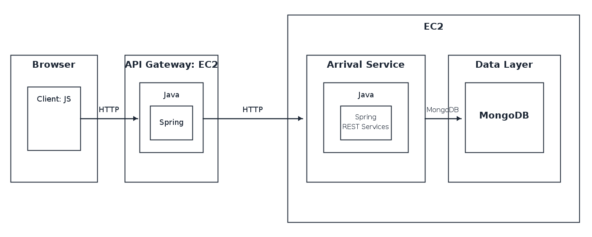

# Arrival Workshop

<table>
  <tr>
    <td valign="middle"><a href="https://sonarqube.cglabs.site/dashboard?id=arrivals"></a></td>
    <td valign="middle">Arrival Workshop es una aplicación para registrar llegadas, dividida en un gateway de API y un servicio de llegadas conectado a MongoDB.</td>
  </tr>
</table>

## Arquitectura



- `api-gateway`: sirve el frontend y reenvía las solicitudes de llegadas.
- `arrival-service`: valida, agrega la fecha y hora, guarda y consulta las llegadas.
- `db`: ejecuta MongoDB con volúmenes persistentes de Docker.

## Requisitos

- Java 21
- Maven 3.9 o superior
- Docker Desktop con Compose v2

## Ejecución local con Maven

Primero inicia MongoDB:

```bash
docker run -d --name arrival-db -p 27017:27017 mongo:8
```

En una terminal, inicia el servicio de llegadas:

```bash
cd arrival-service
mvn clean package
java -jar target/arrival-service-1.0.0.jar
```

En otra terminal, inicia el gateway:

```bash
cd api-gateway
mvn clean package
ARRIVAL_SERVICE_URL=http://localhost:8081 java -jar target/arrival-api-gateway-1.0.0.jar
```

Abre `http://localhost:8080` y registra una llegada. El navegador enviará solicitudes `POST` y `GET` asíncronas a través del gateway.

Pruebas directas de la API:

```bash
curl -i -X POST http://localhost:8080/api/arrivals \
  -H 'Content-Type: application/json' \
  -d '{"name":"Pedro"}'

curl http://localhost:8080/api/arrivals
```

## Ejecución con Docker Compose

Construye los JAR antes de iniciar los servicios:

```bash
(cd arrival-service && mvn clean package)
(cd api-gateway && mvn clean package)
```

Inicia el gateway, el servicio de llegadas y MongoDB:

```bash
docker compose up -d --build
docker compose ps
docker compose logs gateway
docker compose logs arrival-service
```

Abre `http://localhost:8080`. Solo el gateway se publica en el equipo anfitrión; el servicio de llegadas está disponible dentro de Compose mediante el nombre `arrival-service`.

Para consultar los datos de MongoDB:

```bash
docker compose exec db mongosh arrival_workshop
db.arrivals.find()
exit
```

Detén la aplicación conservando los datos:

```bash
docker compose down
```

Detén la aplicación y elimina también los volúmenes de la base de datos:

```bash
docker compose down -v
```

## Docker Hub

Construye y publica las imágenes reemplazando `DOCKERHUB_USER`:

```bash
docker build -t DOCKERHUB_USER/arrival-service:1.0 ./arrival-service
docker build -t DOCKERHUB_USER/arrival-gateway:1.0 ./api-gateway

docker login
docker push DOCKERHUB_USER/arrival-service:1.0
docker push DOCKERHUB_USER/arrival-gateway:1.0
```

## Despliegue en AWS

Utiliza dos instancias EC2 con Amazon Linux 2023:

1. Instancia del servicio: ejecuta `arrival-service` y MongoDB. Permite el puerto `8081` únicamente desde el grupo de seguridad del gateway.
2. Instancia del gateway: ejecuta `arrival-gateway`. Permite el puerto `8080` desde la red de clientes y el puerto SSH `22` únicamente desde tu IP.

Instala Docker en cada instancia:

```bash
sudo yum update -y
sudo yum install -y docker
sudo service docker start
sudo usermod -a -G docker ec2-user
```

Inicia sesión nuevamente después de agregar el usuario al grupo de Docker.

En la instancia del servicio:

```bash
docker network create arrival-network
docker pull DOCKERHUB_USER/arrival-service:1.0
docker run -d \
  --name arrival-db \
  --restart unless-stopped \
  --network arrival-network \
  -v arrival-mongodb:/data/db \
  -v arrival-mongodb-config:/data/configdb \
  mongo:8

docker run -d \
  --name arrival-service \
  --restart unless-stopped \
  --network arrival-network \
  -e PORT=8081 \
  -e MONGODB_URI=mongodb://arrival-db:27017/arrival_workshop \
  -p 8081:8081 \
  DOCKERHUB_USER/arrival-service:1.0
```

MongoDB y el servicio se comunican mediante la red privada de Docker usando el nombre `arrival-db`; MongoDB no necesita publicar un puerto en el host.

Para un despliegue más seguro, mantén MongoDB y el servicio en una red privada de Docker y expón únicamente el puerto del servicio al gateway. La dirección privada indicada debe ser accesible desde el contenedor del gateway y debe reemplazarse por la dirección real de la red.

En la instancia del gateway:

```bash
docker pull DOCKERHUB_USER/arrival-gateway:1.0
docker run -d \
  --name arrival-gateway \
  --restart unless-stopped \
  -e PORT=8080 \
  -e ARRIVAL_SERVICE_URL=http://ARRIVAL_SERVICE_PRIVATE_IP:8081 \
  -p 8080:8080 \
  DOCKERHUB_USER/arrival-gateway:1.0
```

Verifica desde un navegador:

```text
http://GATEWAY_PUBLIC_DNS:8080
```

Verifica desde la instancia del gateway:

```bash
curl http://localhost:8080/api/arrivals
```

Termina ambas instancias EC2 después de la demostración para evitar cargos inesperados.

## Evidencia en video

Muestra la arquitectura, el registro desde el frontend, la lista de llegadas, `docker compose ps`, los documentos de MongoDB, las etiquetas de Docker Hub y la solicitud final del navegador a través del DNS público de la instancia EC2 del gateway.

No grabes contraseñas, claves de acceso, llaves privadas ni tokens.
