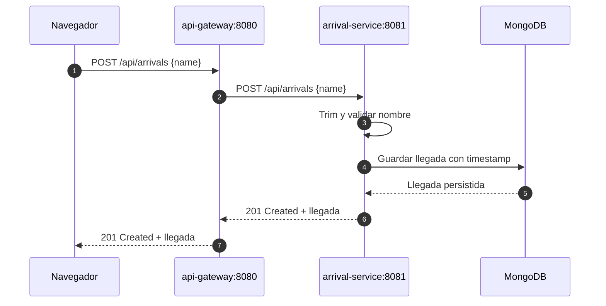
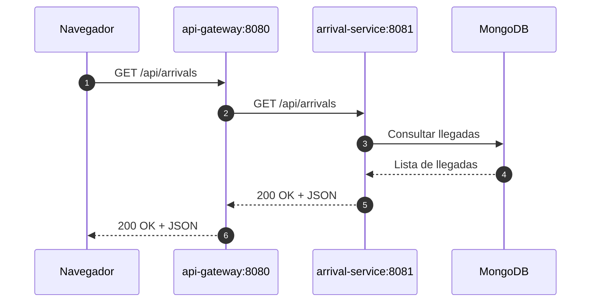

# Arrival Workshop

<table>
  <tr>
    <td valign="middle"><a href="https://sonarqube.cglabs.site/dashboard?id=arrivals"></a></td>
    <td valign="middle">Arrival Workshop es una aplicación para registrar llegadas, dividida en un gateway de API y un servicio de llegadas conectado a MongoDB.</td>
  </tr>
</table>

## Arquitectura


- `api-gateway`: sirve el frontend y reenvía las solicitudes de llegadas.
- `arrival-service`: valida, agrega la fecha y hora, guarda y consulta las llegadas.
- `db`: ejecuta MongoDB con volúmenes persistentes de Docker.

El navegador se comunica únicamente con `api-gateway` mediante el puerto `8080`. El gateway funciona como punto de entrada HTTP y reenvía las solicitudes a `arrival-service` mediante la red privada de Docker. El servicio contiene la lógica de negocio y utiliza MongoDB para persistir las llegadas; MongoDB no se expone directamente al navegador.

### Flujo de registro (`POST`)

Cuando el usuario envía un nombre, el navegador realiza un `POST` al gateway. El gateway reenvía el mismo cuerpo al servicio, que valida y limpia el nombre antes de guardarlo en MongoDB.



### Flujo de consulta (`GET`)

Cuando se carga o actualiza la página, el navegador solicita la lista de llegadas. El gateway reenvía la consulta al servicio, que obtiene los registros desde MongoDB y devuelve la respuesta JSON.



La API pública expone estos endpoints:

| Método | Ruta | Uso |
| --- | --- | --- |
| `POST` | `/api/arrivals` | Registrar una llegada con `{ "name": "..." }` |
| `GET` | `/api/arrivals` | Consultar todas las llegadas |

## Requisitos

- Java 21
- Maven 3.9 o superior
- Docker Desktop con Compose v2

## Pruebas automatizadas

Ejecuta las pruebas unitarias y la verificación completa del proyecto:

```bash
mvn --batch-mode clean verify
```

Este mismo comando se ejecuta en el job `Ejecutar pruebas` de GitHub Actions.

## Ejecución local con Maven

Primero inicia MongoDB:

```bash
docker run -d --name arrival-db -p 27017:27017 mongo:8
```

En una terminal, inicia el servicio de llegadas:

```bash
cd arrival-service
mvn clean package
java -jar target/arrival-service-1.0.0.jar
```

En otra terminal, inicia el gateway:

```bash
cd api-gateway
mvn clean package
ARRIVAL_SERVICE_URL=http://localhost:8081 java -jar target/arrival-api-gateway-1.0.0.jar
```

Abre `http://localhost:8080` y registra una llegada. El navegador enviará solicitudes `POST` y `GET` asíncronas a través del gateway.

Pruebas directas de la API:

```bash
curl -i -X POST http://localhost:8080/api/arrivals \
  -H 'Content-Type: application/json' \
  -d '{"name":"Pedro"}'

curl http://localhost:8080/api/arrivals
```

## Ejecución con Docker Compose

Construye los JAR antes de iniciar los servicios:

```bash
(cd arrival-service && mvn clean package)
(cd api-gateway && mvn clean package)
```

Inicia el gateway, el servicio de llegadas y MongoDB:

```bash
docker compose up -d --build
docker compose ps
docker compose logs gateway
docker compose logs arrival-service
```

Abre `http://localhost:8080`. Solo el gateway se publica en el equipo anfitrión; el servicio de llegadas está disponible dentro de Compose mediante el nombre `arrival-service`.

Para consultar los datos de MongoDB:

```bash
docker compose exec db mongosh arrival_workshop
db.arrivals.find()
exit
```

Detén la aplicación conservando los datos:

```bash
docker compose down
```

Detén la aplicación y elimina también los volúmenes de la base de datos:

```bash
docker compose down -v
```

## Docker Hub

Construye y publica las imágenes reemplazando `DOCKERHUB_USER`:

```bash
docker build -t DOCKERHUB_USER/arrival-service:1.0 ./arrival-service
docker build -t DOCKERHUB_USER/arrival-gateway:1.0 ./api-gateway

docker login
docker push DOCKERHUB_USER/arrival-service:1.0
docker push DOCKERHUB_USER/arrival-gateway:1.0
```

## Despliegue en AWS

El despliegue se realiza automáticamente mediante GitHub Actions usando una sola instancia EC2 con Amazon Linux 2023. El workflow se encuentra en `.github/workflows/ci-cd.yml` y se ejecuta cuando un `push` a `main` modifica código, dependencias, configuración Docker o el propio workflow. Los cambios exclusivos en `README.md` o `assets/**` no disparan el pipeline.

El pipeline realiza estas etapas:

1. Ejecuta las pruebas Maven.
2. Ejecuta el análisis de SonarQube y valida el Quality Gate.
3. Construye y publica `arrival-service` y `arrival-gateway` en Docker Hub usando el SHA del commit.
4. Se conecta por SSH a la instancia EC2.
5. Verifica que Docker exista; si no existe, lo instala, inicia el servicio y agrega `ec2-user` al grupo de Docker.
6. Crea la red Docker, inicia MongoDB y actualiza los contenedores del servicio y del gateway.

Configura estas variables en **Settings > Secrets and variables > Actions > Variables**:

| Variable | Descripción |
| --- | --- |
| `DOCKERHUB_USERNAME` | Usuario de Docker Hub |
| `AWS_EC2_HOST` | DNS público de la instancia EC2 |
| `AWS_SSH_USER` | Usuario SSH, normalmente `ec2-user` |
| `ARRIVAL_SERVICE_URL` | URL interna del servicio, normalmente `http://arrival-service:8081` |

Configura estos secrets en la misma sección:

| Secret | Descripción |
| --- | --- |
| `DOCKERHUB_TOKEN` | Token de acceso de Docker Hub |
| `SONAR_TOKEN` | Token de SonarQube |
| `AWS_EC2_SSH_KEY` | Llave privada SSH de la instancia EC2 |

La instancia EC2 debe permitir el puerto `8080` desde la red de clientes y el puerto SSH `22` desde el runner de GitHub Actions. MongoDB y `arrival-service` permanecen dentro de la red Docker y no necesitan publicar sus puertos en Internet.

Después de un despliegue exitoso, verifica la aplicación desde un navegador usando HTTP:

```text
http://GATEWAY_PUBLIC_DNS:8080
```

También puedes verificar la API desde la instancia EC2:

```bash
curl http://localhost:8080/api/arrivals
```
